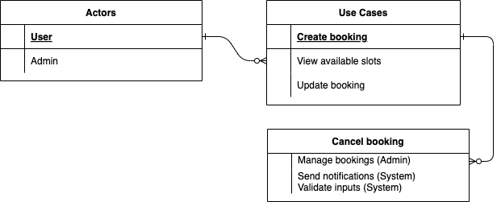

# Requirement Analysis in Software Development

## Introduction

This repository is dedicated to exploring the concept of requirement analysis in software development. It includes documentation, templates, and best practices to guide developers, project managers, and stakeholders in gathering, analyzing, and documenting software requirements effectively.

The primary goal is to ensure that all project stakeholders have a shared understanding of the requirements, reducing ambiguities and enhancing project outcomes.

## What is Requirement Analysis?

Requirement Analysis is a crucial phase in the Software Development Lifecycle (SDLC) that involves identifying, gathering, and documenting the functional and non-functional requirements of a software project. This process ensures a clear understanding of the project scope and objectives among stakeholders, developers, and end-users.

### Key Activities in Requirement Analysis:
1. **Requirement Gathering**: Collecting information from stakeholders to understand their needs and expectations.
2. **Requirement Documentation**: Clearly documenting the requirements in a structured format.
3. **Requirement Validation**: Ensuring that the documented requirements align with stakeholder expectations and are feasible to implement.
4. **Requirement Prioritization**: Determining which requirements are critical and must be addressed first.

### Importance in SDLC:
- **Foundation for Design and Development**: Requirement analysis provides the blueprint for designing and developing software solutions.
- **Reduces Ambiguities**: Clear requirements minimize misunderstandings and scope creep during development.
- **Improves Stakeholder Satisfaction**: By accurately capturing and addressing user needs, projects are more likely to meet stakeholder expectations.
- **Cost and Time Efficiency**: Identifying potential issues early in the lifecycle reduces the risk of costly rework later.
- **Ensures Project Success**: Comprehensive requirement analysis increases the likelihood of delivering a high-quality product that fulfills user needs.

By performing effective requirement analysis, teams can align technical deliverables with business objectives, ensuring the successful completion of projects.

## Why is Requirement Analysis Important?

Requirement Analysis plays a pivotal role in the Software Development Lifecycle (SDLC). It ensures that the end product meets the intended goals while addressing potential challenges early in the process. Below are three key reasons why Requirement Analysis is critical:

### 1. **Prevents Miscommunication**
Clear and detailed requirements minimize misunderstandings between stakeholders, developers, and project teams. By documenting and validating requirements, all parties have a unified understanding of project objectives, which reduces the risk of conflicts and misaligned expectations.

### 2. **Reduces Development Costs and Time**
Identifying and addressing issues during the requirement phase is significantly less expensive than making changes during later stages of development. A thorough requirement analysis prevents rework, scope creep, and delays, saving time and resources.

### 3. **Ensures Quality and User Satisfaction**
By capturing and prioritizing user needs accurately, requirement analysis ensures that the final product aligns with stakeholder expectations. This results in a software solution that not only meets technical standards but also delivers value to its users.

### Additional Benefits:
- **Improves Risk Management**: Early identification of potential risks helps in devising mitigation strategies.
- **Provides a Strong Foundation**: A well-defined set of requirements serves as a roadmap for design, development, and testing.
- **Facilitates Better Collaboration**: Encourages open communication among all involved parties, fostering teamwork and clarity.

By emphasizing the importance of requirement analysis, teams can improve project outcomes, ensuring efficient use of resources and higher success rates.

## Key Activities in Requirement Analysis

Effective Requirement Analysis involves several key activities that ensure a comprehensive understanding and documentation of the project's requirements. Below are the five primary activities:

- **Requirement Gathering**  
  Collecting information from stakeholders, users, and other relevant parties to identify the needs and objectives of the project. This step involves conducting interviews, workshops, and surveys to gather initial inputs.

- **Requirement Elicitation**  
  Actively exploring and clarifying requirements with stakeholders to uncover implicit needs, constraints, and expectations. Techniques such as brainstorming, use case analysis, and prototyping are commonly used during this phase.

- **Requirement Documentation**  
  Organizing and recording the gathered information in a structured format, such as a Software Requirements Specification (SRS) document. This ensures that all requirements are clearly defined, traceable, and accessible to all stakeholders.

- **Requirement Analysis and Modeling**  
  Analyzing the documented requirements to identify potential conflicts, inconsistencies, and ambiguities. This step often involves creating models like data flow diagrams, use case diagrams, or process flows to visualize and validate the requirements.

- **Requirement Validation**  
  Ensuring that the documented and modeled requirements accurately reflect stakeholder needs and are feasible for implementation. Validation methods include stakeholder reviews, prototyping, and test case generation to verify completeness and correctness.

By following these activities systematically, project teams can establish a solid foundation for the software development process, reducing risks and improving overall project outcomes.

## Types of Requirements

In software development, requirements are broadly classified into two categories: Functional Requirements and Non-functional Requirements. Below is a breakdown of these requirements with specific examples related to a booking management project.

### Functional Requirements

Functional Requirements define the specific behavior or functions of the system. They describe *what the system should do* to fulfill its purpose.

#### Examples for the Booking Management Project:
- Users can create, update, and cancel bookings.
- The system should allow users to view available time slots for appointments.
- Admins can manage bookings, including marking appointments as attended or not attended.
- Notifications should be sent to users to confirm booking details.
- The system should validate user inputs (e.g., ensuring all required fields in the booking form are completed).

### Non-functional Requirements

Non-functional Requirements specify the *quality attributes* of the system. They describe *how the system performs* its functions.

#### Examples for the Booking Management Project:
- The system must handle at least 100 concurrent users without performance degradation.
- Booking confirmations should be sent to users within 2 seconds of submission.
- The interface should be user-friendly, with a responsive design that works on mobile and desktop devices.
- The system should ensure data security by encrypting sensitive user information.
- The system must have a 99.9% uptime availability.

Understanding and documenting both functional and non-functional requirements is critical to building a system that not only meets user needs but also delivers a high-quality user experience.

## Use Case Diagrams

Use Case Diagrams are a powerful tool in Requirement Analysis to visualize the interactions between users (actors) and the system's functionalities (use cases). They provide a clear understanding of the system's behavior and help identify the scope and key functionalities of the project.

### Benefits of Use Case Diagrams:
- Simplify complex systems by breaking them into smaller, manageable use cases.
- Facilitate communication among stakeholders by providing a visual representation.
- Serve as a foundation for system design and development.

Below is an example of a use case diagram for the booking management system:

### Actors and Use Cases:
- **Actors:**
  - User
  - Admin
- **Use Cases:**
  - Create booking
  - View available slots
  - Update booking
  - Cancel booking
  - Manage bookings (Admin)
  - Send notifications (System)
  - Validate inputs (System)

